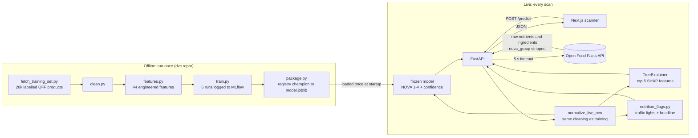

# Chewsy

[](https://github.com/prem-thatikonda29/chewsy/actions/workflows/ci.yml)

A Yuka-style barcode scanner built for a Feature Engineering & MLOps mini-project.
Scan or type a real product barcode and Chewsy live-fetches the product from the
[Open Food Facts](https://world.openfoodfacts.org) API, then answers **two separate questions**:

1. **How is it made?** A model trained on community-labelled products predicts the
   **NOVA processing level (1–4)** and shows the top SHAP features behind that call.
2. **What's in it?** The per-100g nutrients are banded into NHS-style traffic lights
   (sugars, fat, saturated fat, salt) plus two custom positives (fibre, protein).

The two axes are scored independently. A candy bar can be ultra-processed *and* low in
sugar. Olive oil can be minimally processed *and* red for fat. NOVA is a descriptor of
formulation, never a judgement of healthiness, and the UI never labels a class good or bad.

> **Scope:** this is a course project. The model classifies industrial formulation from
> ingredients and nutrients. It does not predict Nutri-Score, does not log meals, and does
> not aim for global coverage.

## Contents

- [How it works](#how-it-works)
- [Trained offline vs. live](#trained-offline-vs-live)
- [Model and results](#model-and-results)
- [The two-axis result](#the-two-axis-result)
- [API](#api)
- [Frontend](#frontend)
- [Hard rules the code enforces](#hard-rules-the-code-enforces)
- [Repository layout](#repository-layout)
- [Quickstart (local)](#quickstart-local)
- [Data and model storage (DVC → HuggingFace)](#data-and-model-storage-dvc--huggingface)
- [Tests and CI](#tests-and-ci)
- [Deployment](#deployment)
- [Monitoring](#monitoring)
- [Configuration](#configuration)
- [Command reference](#command-reference)
- [Limitations](#limitations)
- [Project status](#project-status)
- [Docs](#docs)

## How it works



| Layer | Tech | Entry point |
|---|---|---|
| Data pipeline | pandas, scikit-learn, DVC | `src/fetch_training_set.py` → `clean.py` → `features.py` → `train.py` → `package.py` |
| Experiment tracking | MLflow (SQLite backend + model registry) | `mlflow.db`, `mlruns/`, experiment `chewsy-nova` |
| Serving API | FastAPI, Pydantic, SHAP | `app/main.py` |
| Frontend | Next.js 16 (App Router), React 19, Tailwind 4, shadcn/ui, `html5-qrcode` | `frontend/app/page.tsx` |
| Packaging | Multi-stage Docker (Node build + Python 3.12 runtime) | `Dockerfile`, `entrypoint.sh` |
| CI/CD | GitHub Actions: tests, frontend checks, Docker Hub push | `.github/workflows/ci.yml` |

## Trained offline vs. live

This split is the core design decision, so it is stated precisely:

- **Trained once, offline.** The model is trained on 20,000 products that Open Food
  Facts' community has already labelled with a NOVA group (5,000 per class; 19,998 remain
  after cleaning). The training run produces `models/model.joblib`, which does not change
  until someone retrains it.
- **Live, on every scan.** The scanned barcode is almost never one of the training rows.
  The API fetches that product's raw nutrients and ingredients from Open Food Facts at
  request time and feeds them into the frozen model.
- **The model always computes the verdict.** The output is never a passthrough, and it is
  never conditioned on whether Open Food Facts already has a label. The API never reads OFF's
  stored `nova_group` for the product being scanned, even when one exists. Open Food Facts
  tells you NOVA when it knows; Chewsy gives an answer when it doesn't, using only the raw
  ingredients.

## Model and results

The headline metric is **macro-F1**, not accuracy, because the NOVA classes are balanced by
construction but the real-world prevalence is not. The split is stratified 80/20 with
`random_state=42`, and the feature pipeline is fit on the training side only.

Current configuration (Gen 3): sparse-view augmentation at a 20% text-dropout rate, so the
model is also trained on stub-shaped records. The "sparse" column scores the same model on
stub-shaped evaluation rows, since roughly three in four live Open Food Facts records are thin.

| Run | Model | Macro-F1 | Sparse macro-F1 |
|---|---|---:|---:|
| 1 | Logistic Regression (nutrients only) | 0.7936 | 0.5701 |
| 2 | Logistic Regression (+ ingredient text) | 0.8749 | 0.6207 |
| 3 | Random Forest | 0.9394 | 0.7674 |
| 4 | HistGradientBoosting | 0.9432 | 0.7688 |
| **5** | **XGBoost (champion)** | **0.9465** | **0.7726** |
| 6 | k-Nearest Neighbours | 0.8509 | 0.6970 |

Run 5 is registered as `chewsy-nova` version 4 with the `champion` alias. Its weights are
packaged to `models/model.joblib`, and a test asserts that the registry and the joblib file
produce identical predictions. The values above come straight from `mlflow.db`.

**Feature engineering** (`src/features.py`): 17 numeric nutrient and count features, brand
and category-tag frequency encodings, and 25 TruncatedSVD components from the ingredient
text. Energy and sugars are skew-corrected (sqrt and log1p), and missing nutrients are
imputed with a group-median imputer fit inside the pipeline, so there is no pre-split leakage.
PCA is analysis-only. SHAP explains the real engineered features, not PCA components.

**Explainability:** each response includes the top-5 SHAP contributions toward the predicted
class, computed by a `shap.TreeExplainer` built once at startup. Every MLflow run logs a
confusion matrix, and the champion also logs SHAP summary plots.

### Run configurations

Every run shares the same stratified 80/20 split (`random_state=42`) and the same feature
pipeline. Only the feature flags and the classifier change, so differences between runs can
be attributed to them.

| Run | Text (TF-IDF → SVD) | Brand and category encoders | Classifier and hyperparameters |
|---|:-:|:-:|---|
| 1 | no | no | `LogisticRegression(max_iter=2000, class_weight="balanced")` |
| 2 | yes | no | `LogisticRegression(max_iter=2000, class_weight="balanced")` |
| 3 | yes | yes | `RandomForestClassifier(n_estimators=300, class_weight="balanced")` |
| 4 | yes | yes | `HistGradientBoostingClassifier(max_iter=300)` |
| 5 | yes | yes | `XGBClassifier(n_estimators=300, max_depth=6, learning_rate=0.1, subsample=0.9, colsample_bytree=0.9, tree_method="hist")` wrapped in `NovaLabelAdapter` |
| 6 | yes | yes | `KNeighborsClassifier(n_neighbors=15)` |

Shared feature settings: 17 numeric nutrient, count and ratio columns (median imputation,
`VarianceThreshold(1e-4)`, `StandardScaler`), `FrequencyEncoder` on brand,
`CategoryTagFrequencyEncoder` on category tags, and a text branch of TF-IDF
(1–2 grams, 500 features, `min_df=5`, `max_df=0.95`, English stop words) reduced by
TruncatedSVD to 25 components. The result is 44 features. Missing nutrients are imputed
inside the pipeline using training-side medians only, which closed a pre-split leak found
during Stage 2.

### How the champion was chosen

1. **Baseline selection.** The six runs above were compared by macro-F1. XGBoost (run 5)
   won at 0.9489 with no augmentation.
2. **The sparse problem.** Scored on stub-shaped records (no ingredient text, no tags),
   that same model fell to 0.4135. Roughly three in four live Open Food Facts products look
   like that, so the baseline score overstated real-world performance.
3. **Text-dropout augmentation.** Training gained extra rows that copy 20% of the training
   set with the ingredient text and category tags blanked and the counts set to NaN. These
   twins are added to the training side only, and an eval-hash check guards against leakage
   into the test split. The rate was swept over the champion configuration:

| Text-dropout rate | Macro-F1 (full eval) | Macro-F1 (sparse eval) |
|---:|---:|---:|
| 0 (none) | 0.9489 | 0.4135 |
| 0.1 | 0.9465 | 0.7540 |
| **0.2 (chosen)** | **0.9465** | **0.7726** |
| 0.3 | 0.9455 | 0.7754 |

0.2 was chosen because it gives most of the sparse-input gain (0.41 → 0.77) for a full-eval
cost of about 0.002, and the sparse score barely improves beyond it. Every run now logs both
the full-eval and sparse metrics.

## Experiment tracking (MLflow)

- **Backend:** a local SQLite store, `mlflow.db`, with artifacts in `mlruns/`. Both are
  committed on purpose, because the experiment history is part of the project evidence.
- **Experiment:** `chewsy-nova`. Each run is named for its configuration, for example
  `run5_xgboost`, and the sweep runs are tagged `text-dropout-sweep`.
- **Per run:** the parameters (model family, feature flags, `text_dropout_frac`,
  `n_svd_components`), the metrics (`f1_macro`, `accuracy`, `sparse_f1_macro`,
  `sparse_f1_class_3`, `sparse_f1_class_4`), and a confusion matrix. Runs 3, 4 and 5 also
  log SHAP summary plots, one per class.
- **Model binaries:** only the champion is logged as a model. Comparison runs store
  metrics and plots only. Logging every model in pickle format would add about 673 MB to
  `mlruns/`, past GitHub's 100 MB per-file limit, and the default serialisation was about 5×
  larger again.
- **Registry:** `--register` picks the winner by macro-F1, considering only runs at the
  selected text-dropout rate. Sweep and packaging runs are excluded, so the matrix decides the
  champion. The winner is registered as `chewsy-nova` and tagged with the alias `champion`.
  `src/package.py` then loads `models:/chewsy-nova@champion` and writes `model.joblib`, and a
  test confirms the two produce identical predictions.

```bash
mlflow ui   # then open http://127.0.0.1:5000 and select the chewsy-nova experiment
```

## Pipeline and data versioning (DVC)

`dvc.yaml` describes the whole data-to-model graph. Each stage declares only the inputs and
parameters it reads, so changing a parameter re-runs just the stages downstream of it.

| Stage | Command | Reads | Writes |
|---|---|---|---|
| `fetch` | `src/fetch_training_set.py` | `params.yaml` `fetch.target_per_class` | `data/raw/openfoodfacts_training_set.csv` |
| `clean` | `src/clean.py` | raw CSV | `data/processed/openfoodfacts_clean.csv` |
| `features` | `src/features.py` | clean CSV, `features.n_svd_components` | feature evidence (printed) |
| `train` | `train.py --runs 1-6 --register` then `package.py` | clean CSV, `features.n_svd_components`, `train.text_dropout_frac` | `models/model.joblib` |

`params.yaml` holds the only three values the pipeline reads: `fetch.target_per_class: 5000`,
`features.n_svd_components: 25` and `train.text_dropout_frac: 0.20`.

- **Tracked by DVC:** the raw and clean CSVs and `model.joblib`. Their `.dvc` pointers and the
  remote are described in the storage section above.
- **Tracked by git:** `dvc.yaml`, `dvc.lock`, `params.yaml`, `mlflow.db`, `mlruns/`, and
  `models/training_reference.csv`, which is not a pipeline output.
- **Retraining:** change a parameter, or run `dvc repro --force <stage>`. After a retrain,
  re-package the model and re-pin the outputs:

```bash
dvc repro
dvc commit train && dvc push   # re-pin the pipeline output and upload it
```

## The two-axis result

`POST /predict` returns both axes in one response.

- **Processing (NOVA):** the predicted class, its label, the full class probability vector,
  and the SHAP features. If the input is a stub, the result shows a dashed
  "not enough information" state instead of a confident class.
- **Nutrients:** a per-100g facts panel, plus NHS traffic lights from the current published
  thresholds. These are not the older 2007 FSA figures. Drinks use the published per-100 ml
  table, which is exactly half the solids values. Fibre and protein use custom bands
  (good ≥ 6 g and ≥ 10 g; moderate ≥ 3 g and ≥ 5 g), and these are never presented as traffic
  lights, because the FSA scheme doesn't define them.

Both axes are computed locally from the normalized row. Open Food Facts' own Nutri-Score and
nutrition grades are excluded from the feature set and are never shown.

## API

Run locally with `uvicorn app.main:app --reload --port 8000`. Interactive docs are at
`/docs`.

| Method | Path | Purpose |
|---|---|---|
| `POST` | `/predict` | Barcode in, model verdict + nutrient facts out |
| `GET` | `/health` | Liveness, and whether the model has loaded |
| `GET` | `/metrics` | In-memory counters: requests, errors, average latency, predictions per class, sparse scans |

```bash
curl -s -X POST http://localhost:8000/predict \
  -H 'Content-Type: application/json' \
  -d '{"barcode": "3017620422003"}'
```

`barcode` must be 6–14 digits (422 otherwise). Error mapping:

| Status | Meaning |
|---|---|
| `200` | Scored. Body includes `predicted_nova`, `confidence`, `class_probabilities`, `shap_top_features`, `nutrition_100g`, `traffic_lights`, `positives`, `headline`, `ingredients_text`, and `data_sparse` |
| `404` | Barcode is unknown to Open Food Facts |
| `422` | Barcode fails the format check |
| `503` | Open Food Facts timed out, is unreachable, or returned a 5xx or 429. This is never reported as "not found" |

`data_sparse: true` means the Open Food Facts record is a stub (no ingredient list, no
category tags, and missing counts). The verdict is still model-computed, but the UI must
present it as low-information.

## Frontend

The UI is a single-page scanner in `frontend/`:

- **Camera scanning:** `html5-qrcode` reads EAN-13, UPC-A and EAN-8 from the rear camera.
  Decoding reads bar widths, not printed digits, and the EAN checksum is verified during
  decoding, so only valid codes are sent to the API. Only the decoded digit string leaves
  the browser; no image is uploaded.
- **Manual entry:** a keyboard-operable fallback for when the camera is unavailable, denied,
  or insecure (camera access requires HTTPS or `localhost`).
- **Results:** `ResultCard` with the processing badge, traffic-light chips, facts panel,
  headline, `ProbabilityBars`, and `ShapChart`. Scan history lasts for the current page
  session.

The frontend never computes a score, band or headline. Every value comes from `POST /predict`
through `frontend/lib/api.ts`, so there is one source of truth. Design rules live in
[`DESIGN.md`](./DESIGN.md) and [`PRODUCT.md`](./PRODUCT.md).

## Hard rules the code enforces

These come from [`AGENTS.md`](./AGENTS.md) and are enforced in code, not only documented:

1. **Macro-F1 is the selection metric**, not accuracy.
2. **Nutri-Score fields are never features.** `FORBIDDEN_LEAKAGE_FIELDS` is asserted in
   the fetch, clean and training steps.
3. **OFF's `nova_group` never reaches the model or the response.** It is stripped in
   `app/off_client.py`, asserted absent in `normalize_live_row`, and asserted again in
   `score_row`. A test fixture deliberately contains `nova_group` and Nutri-Score fields to
   prove they are removed.
4. **Custom transformers live in `src/features.py`**, so the pickled pipeline can be loaded
   in a fresh process.
5. **Every Open Food Facts call has a 5 s timeout** and maps failures to 404 or 503. A hung
   upstream can't freeze the live demo.
6. **The frontend calls the API over HTTP** and never bundles or re-implements the model.

## Repository layout

```
├── app/                      FastAPI service
│   ├── main.py               /predict, /health, /metrics, SHAP, structured logging
│   ├── off_client.py         Open Food Facts client (timeouts, typed errors, leakage strip)
│   └── schemas.py            Pydantic request and response models
├── src/
│   ├── fetch_training_set.py Stage 1: pull 5,000 labelled products per NOVA class
│   ├── clean.py              Stage 2: cleaning, and normalize_live_row for serving
│   ├── features.py           Stage 3: feature pipeline and custom transformers
│   ├── train.py              Stage 4: six tracked runs, text-dropout sweep, registry
│   ├── package.py            Stage 5: registry champion to models/model.joblib
│   ├── nutrition_flags.py    Stage 6.7: traffic lights, positives, headline
│   ├── batch_predict.py      Offline CSV scoring through the same score_row path
│   ├── drift_check.py        Stage 12.2: KS drift check of live rows vs. reference
│   └── params.py             Reads params.yaml
├── frontend/                 Next.js scanner UI
├── tests/                    pytest suite (129 tests collected)
├── models/
│   ├── model.joblib          packaged champion (DVC-tracked, git-ignored)
│   └── training_reference.csv  drift baseline (committed)
├── docs/drift_report.png     KS drift plot from a live run
├── dvc.yaml / dvc.lock       pipeline graph (fetch → clean → features → train)
├── params.yaml               pipeline parameters
├── mlflow.db, mlruns/        experiment history and registry (committed)
├── Dockerfile, entrypoint.sh, render.yaml
├── .github/workflows/ci.yml
├── AGENTS.md                 agent instructions and hard rules
├── Chewsy_PRD_Roadmap.md     stage-by-stage plan with "done when" conditions
├── PRODUCT.md, DESIGN.md     product and visual design guidance
└── conftest.py               puts the repo root on sys.path for pytest
```

## Quickstart (local)

Requires Python 3.12 (`shap` 0.52 needs ≥ 3.12) and Node 20+.

```bash
python -m venv .venv && source .venv/bin/activate
pip install -r requirements.txt

# restore the DVC-tracked data and model (see the next section for credentials)
export AWS_ACCESS_KEY_ID='HFAK…'
export AWS_SECRET_ACCESS_KEY='…'
export AWS_REQUEST_CHECKSUM_CALCULATION=when_required
export AWS_RESPONSE_CHECKSUM_VALIDATION=when_required
dvc pull

pytest
uvicorn app.main:app --reload --port 8000
cd frontend && npm install && npm run dev   # UI on http://localhost:3000
```

The API **will not start** without `models/model.joblib`, and `load_pipeline()` asserts that
the file exists. On a fresh clone without HuggingFace credentials, the model is missing and
you need the credentials from the next section first.

`dvc repro` runs the whole pipeline (fetch → clean → features → train + register + package).
On a checkout where `dvc pull` has already run, every stage reports *up to date*. Touch
`params.yaml`, or use `dvc repro --force <stage>`, to actually retrain.

## Data and model storage (DVC → HuggingFace)

Large artifacts are versioned with DVC and pushed to a private HuggingFace Storage Bucket
behind the `s3.hf.co` gateway. Git holds the small pointer files (`*.dvc`, `.dvc/config`) and
the committed drift baseline:

| Artifact | Where |
|---|---|
| `data/raw/*.csv`, `data/processed/*.csv` (~15 MB) | DVC → `s3://chewsy-dvc/dvc-store` |
| `models/model.joblib` (17 MB, the packaged champion) | DVC → same remote |
| `models/training_reference.csv` | **git** (drift baseline, small) |
| `mlflow.db`, `mlruns/` (metrics, plots, registry) | **git** (grading evidence) |

`dvc pull` needs S3 credentials for the bucket. Generate them from a HuggingFace token
(*Generate S3 credentials*) and export them as `AWS_ACCESS_KEY_ID` and
`AWS_SECRET_ACCESS_KEY`, as in the Quickstart. Credentials are **never committed**. On a
machine that will keep them, store them once with
`dvc remote modify --local hf-bucket access_key_id …` and
`dvc remote modify --local hf-bucket secret_access_key …`. These go to the git-ignored
`.dvc/config.local`. The two checksum variables work around a known botocore incompatibility
with `s3.hf.co`, where trailing CRC32 checksums break the gateway.

After any retrain, re-package and re-pin the model:

```bash
python src/package.py && dvc add models/model.joblib && dvc push
```

## Tests and CI

```bash
pytest
```

The suite collects **129 tests** across `test_api.py`, `test_features.py`,
`test_nutrition_flags.py`, `test_drift.py`, `test_train.py` and `test_package.py`. The 25 Sep 2026
run recorded 128 passing and 1 skipped. The skipped test is a live Open Food Facts check that
is gated behind `CHEWSY_LIVE_OFF=1`, so the default run makes **no network calls**. The API
tests use a saved Open Food Facts response fixture.

GitHub Actions (`.github/workflows/ci.yml`) runs three jobs on every push:

| Job | When | What |
|---|---|---|
| `test` | every push | `dvc pull`, then `pytest` |
| `frontend` | every push | `npm ci`, `typecheck`, `lint`, `build` |
| `docker` | pushes to `main`, after `test` passes | Builds the image, pushes `:latest` and `:<sha>` to Docker Hub, then triggers a Render deploy of the API |

The `docker` job runs the deploy step **only after the image push succeeds**. A failed push
never redeploys the API. Each push to `main` that passes tests therefore ships to Render with
no manual step.

Required GitHub Actions secrets:

| Secret | Used by | Purpose |
|---|---|---|
| `AWS_ACCESS_KEY_ID`, `AWS_SECRET_ACCESS_KEY` | `test`, `docker` | `dvc pull` of the training data and `model.joblib` |
| `DOCKERHUB_USERNAME`, `DOCKERHUB_TOKEN` | `docker` | Log in to and push the image |
| `RENDER_API_KEY` | `docker` | Authenticates the Render API call that deploys `chewsy-api` |

The Render deploy calls `POST https://api.render.com/v1/services/<service-id>/deploys`
with the key as a bearer token. The service ID is set in `ci.yml`. The key is never printed in
logs. Render does not redeploy image-backed services on a new push by itself, which is why the
step exists.

## Deployment

- **API:** Render (free tier), running the prebuilt Docker Hub image that CI pushes. The
  image runs with `APP_MODE=api`, so the container serves only uvicorn on `$PORT`. Render
  never builds from the repo, because `model.joblib` is git-ignored.
- **Automatic redeploy:** a push to `main` that passes tests and pushes the image triggers
  a Render deploy from CI (see [Tests and CI](#tests-and-ci)). Use the Render dashboard only for
  manual redeploys or rollbacks.
- **UI:** Vercel, at [chewsy-scanner.vercel.app](https://chewsy-scanner.vercel.app). HTTPS keeps
  the camera available on phones.
- **Full stack in one container:** `docker build -t chewsy .` followed by
  `docker run -p 8000:8000 -p 3000:3000 chewsy` runs the API and the Next.js server together.
  The build-time `NEXT_PUBLIC_API_URL` defaults to `http://localhost:8000`.
- **CORS:** the API allows the origins in `FRONTEND_ORIGINS`. The value is read once at
  startup, so changing it on Render requires a redeploy. Set the variable in the Render dashboard,
  then trigger a deploy from there, because CI only redeploys when an image is pushed.
- **Cold starts:** free Render instances sleep after 15 minutes idle. Expect roughly 30–60 s
  on the first request after that.

## Monitoring

Kept deliberately lightweight, as the PRD scoped it:

- **Structured logs:** each `/predict` call writes one JSON line to stdout with the barcode,
  latency, status, predicted class and `data_sparse` flag. Failed requests are logged too,
  with `predicted_nova: null`.
- **`GET /metrics`:** running totals since process start. These reset on restart.
- **Drift check:** `python src/drift_check.py --n 100` samples live products through the
  same serving path and compares them with `models/training_reference.csv`. It runs a KS test
  on numeric columns and a null-fraction delta on every column. The test catches
  documentation drift, such as a rising fibre-missing rate, before values shift. The
  25 Sep 2026 run over 100 live rows flagged `energy_100g` (KS 0.30) and `fiber_100g`
  (KS 0.28, with its null share rising from 53% to 71%). The plot is in
  [`docs/drift_report.png`](./docs/drift_report.png).

## Configuration

| Variable | Used by | Default | Purpose |
|---|---|---|---|
| `FRONTEND_ORIGINS` | API | `http://localhost:3000` | Comma-separated CORS allow-list |
| `PORT` | API, entrypoint | `8000` | API port |
| `APP_MODE` | `entrypoint.sh` | `both` | `both` runs API and UI; `api` runs API only |
| `NEXT_PUBLIC_API_URL` | Frontend (build time) | `http://localhost:8000` | Where the browser sends `/predict` |
| `CHEWSY_LIVE_OFF` | tests | unset | Set to `1` to enable the live Open Food Facts test |
| `MLFLOW_DISABLE_AGENT_HINT` | MLflow | — | Set to `1` to silence the MLflow agent hint (set in CI and on Render) |
| `RENDER_API_KEY` | CI (`docker` job) | — | GitHub secret. Render API key used to trigger the API deploy |
| `AWS_*_CHECKSUM_*` | DVC | — | Set both to `when_required` for `s3.hf.co` |

## Command reference

```bash
# Experiment tracking
python src/train.py --runs 1 2 3 4 5 6          # six tracked runs
python src/train.py --sweep 0 0.1 0.2 0.3       # text-dropout sweep
python src/train.py --register                  # winner → alias 'champion'
mlflow ui                                       # browse sqlite:///mlflow.db

# Packaging and feature evidence
python src/package.py                           # champion → models/model.joblib
python src/features.py                          # prints skew, filter, PCA and SVD numbers

# Serving
uvicorn app.main:app --reload --port 8000

# Batch scoring (CSV with a "barcode" column)
python src/batch_predict.py --input barcodes.csv --output predictions.csv

# Drift check against the training reference
python src/drift_check.py --n 100
python src/drift_check.py --barcodes barcodes.csv   # deterministic re-run
```

## Limitations

- **Labels are community labels.** Training targets come from Open Food Facts' NOVA tags. The
  reported scores measure agreement with those tags, not ground-truth processing levels.
- **Most live records are thin.** Roughly three in four live Open Food Facts products lack
  an ingredient list or category tags. On stub-shaped input, macro-F1 falls to about 0.77
  (from 0.95). The API flags these results as low-information, but it can't fix the
  underlying data gap.
- **Classes are balanced by construction.** The training set has 5,000 products per class,
  which does not reflect how common each class is in the real catalogue.
- **Beverages reuse the `_100g` fields.** Open Food Facts reports drink nutrients per 100 g,
  but the drink thresholds are per 100 ml. The two are treated as equal because most drinks
  have a density close to 1. Alcoholic and syrup-heavy drinks are a known edge case.
- **Fibre and protein bands are custom.** They are reasoned cut-offs, not official thresholds.
- **Live dependency.** Scans depend on Open Food Facts being available. Rate limits (HTTP
  429) show up as a 503 with an availability message.
- **No authentication or rate limiting** on the API. It is a demo service, not production.
- **Metrics and history are in-memory.** `/metrics` resets on restart, and scan history is
  lost on page reload.
- **No frontend unit tests.** The frontend is checked by typecheck, lint and build, plus a
  manual camera test run on a real device.

## Project status

Tracked against [`Chewsy_PRD_Roadmap.md`](./Chewsy_PRD_Roadmap.md):

| Stage | Scope | Status |
|---|---|---|
| 0 | Repo and environment | Done |
| 1 | Data acquisition (live API) | Done |
| 2 | Cleaning and verification | Done |
| 3 | Feature engineering | Done |
| 4 | Modelling and MLflow tracking | Done |
| 5 | Packaging and DVC remote | Done |
| 6 | FastAPI serving and the two-axis response | Done |
| 7 | Next.js frontend | Done |
| 8 | Containerisation | Done |
| 9 | CI/CD to Docker Hub | Done |
| 10 | DVC pipeline | Done |
| 11 | Cloud deployment (adapted: Render API, Vercel UI) | Done |
| 12 | Monitoring (logging, `/metrics`, KS drift check) | Done |

## Docs

- [`Chewsy_PRD_Roadmap.md`](./Chewsy_PRD_Roadmap.md): full stage-by-stage plan, with decisions
  and evidence recorded against each checkbox
- [`AGENTS.md`](./AGENTS.md): hard rules, as-built interfaces and standing risks
- [`PRODUCT.md`](./PRODUCT.md) and [`DESIGN.md`](./DESIGN.md): product principles and visual
  design system
